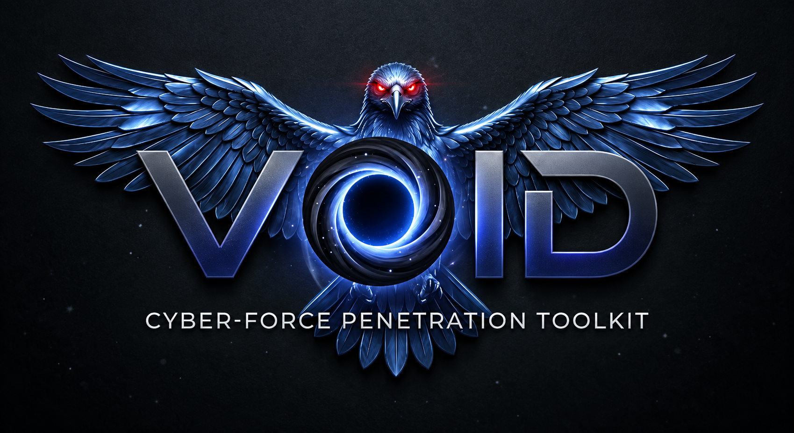
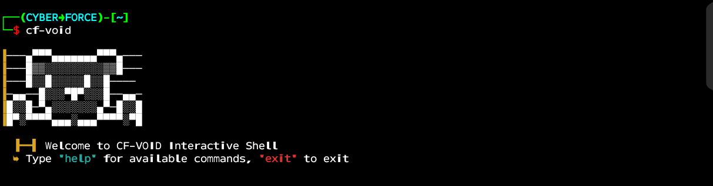
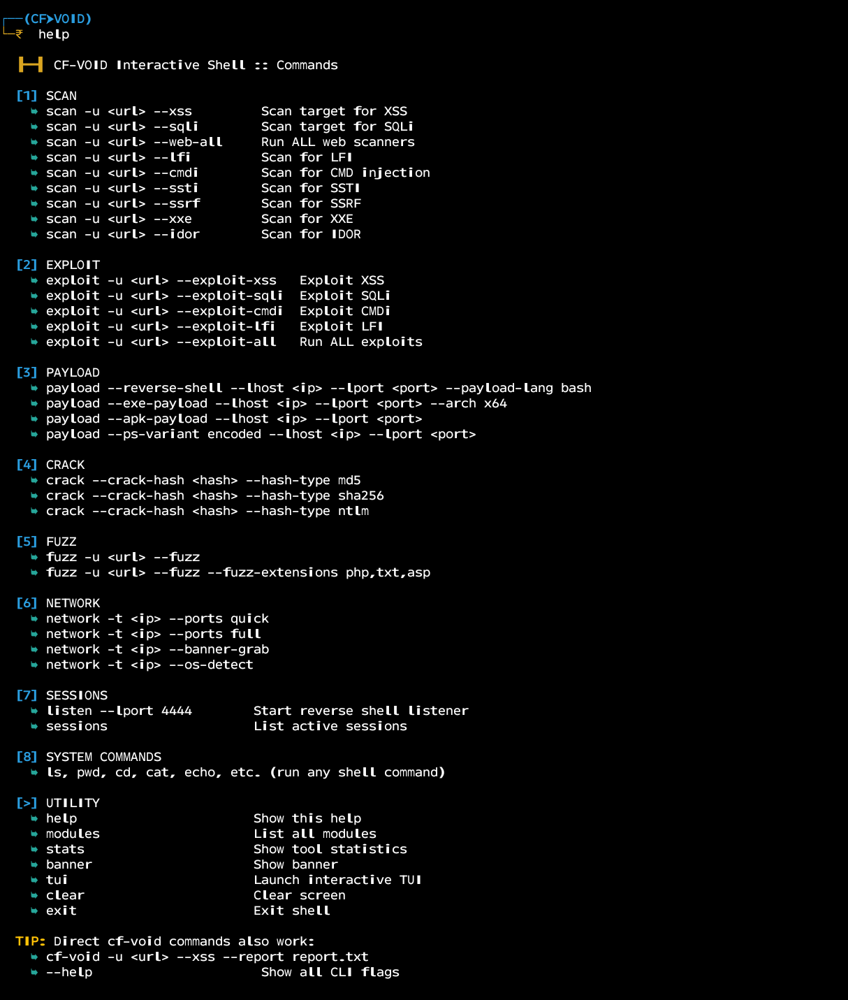
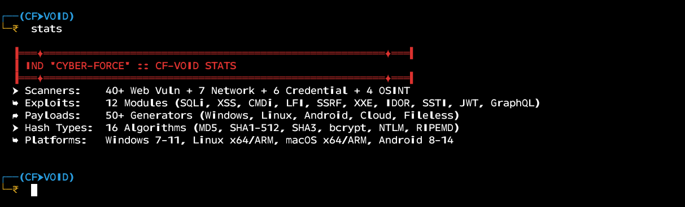
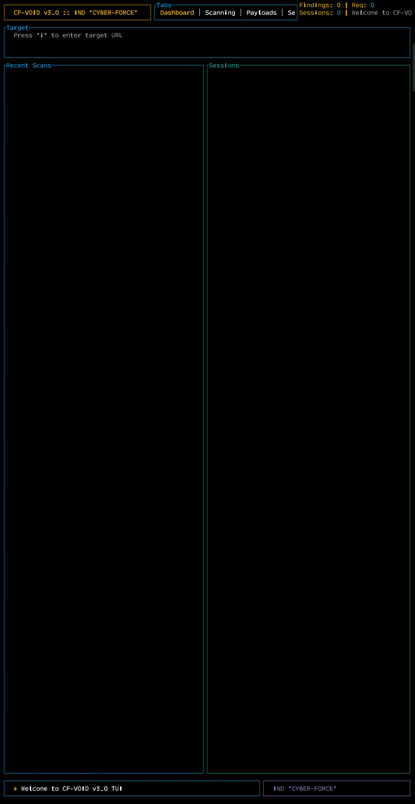
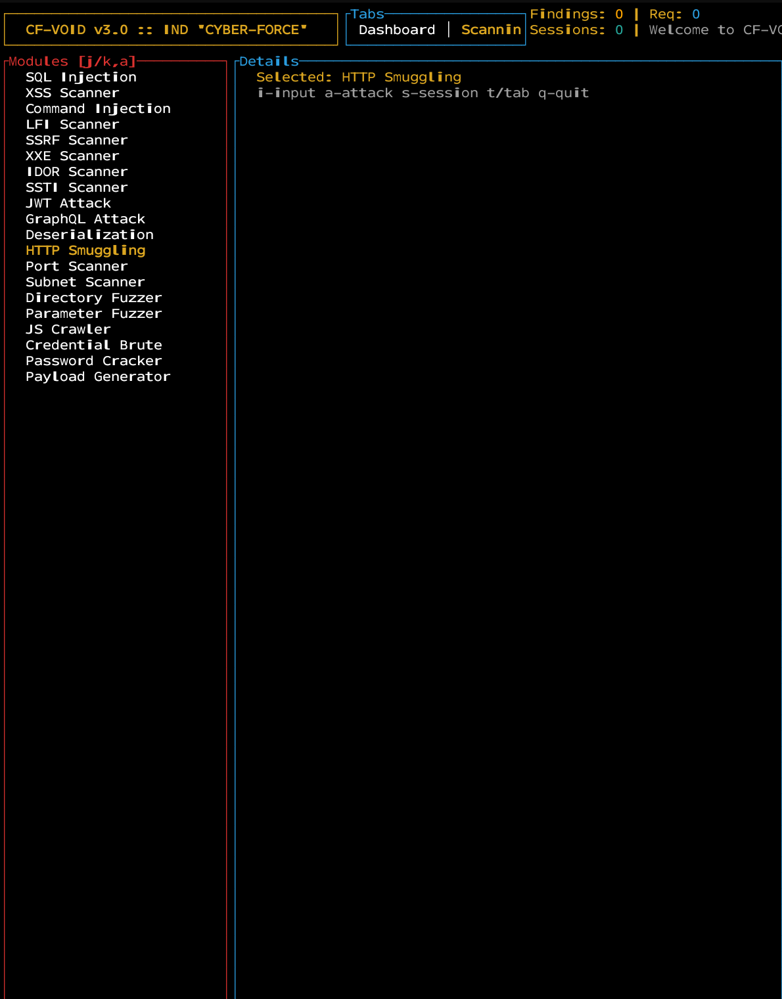
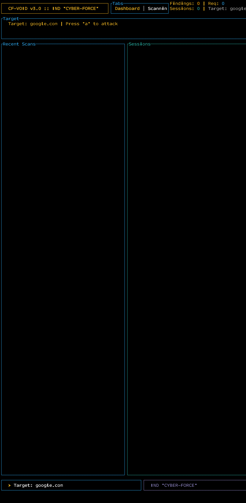

# CF-VOID v5.0

[](https://github.com/ownerVortex525-beep/Open-void/releases)
[](LICENSE)
[](https://www.rust-lang.org/)
[](https://github.com/ownerVortex525-beep/Open-void)
[](https://github.com/ownerVortex525-beep/Open-void/stargazers)
[](https://github.com/ownerVortex525-beep/Open-void/network)
[](https://github.com/ownerVortex525-beep/Open-void/issues)

<p align="center">
  
</p>

**CF-VOID** is a comprehensive offensive security platform built in Rust, designed for penetration testing and security research. It provides a complete toolkit for ethical hackers, security researchers, and red teams.

---

## Screenshots

<p align="center">
  
  
</p>

<p align="center">
  
  
</p>

<p align="center">
  
  
</p>

---

## Key Features

- **40+ Web Vulnerability Scanners** - SQLi, XSS, CMDi, LFI, SSRF, XXE, IDOR, SSTI
- **20+ Exploit Modules** - JWT, GraphQL, Deserialization, HTTP Smuggling, MS17-010, Redis
- **50+ Payload Generators** - Windows, Linux, macOS, Android APK, Cloud, Fileless
- **16 Hash Algorithms** - MD5, SHA1-512, SHA3, bcrypt, NTLM, Python hash, MySQL
- **Advanced Network Scanning** - SYN, UDP, ACK, FIN, Subnet scanning, Banner grab
- **URL Fuzzing** - Directory, Parameter, JS Endpoint discovery (429 handling)
- **Post-Exploitation** - Persistence, Privesc, Lateral Movement, Password Cracking
- **Interactive TUI** - Full terminal UI with tabs and keyboard navigation
- **Interactive Shell** - Command shell with all tool features accessible
- **AI-Powered Attacks** - GPT-4, Claude, Gemini integrations for recon/plan/execute
- **Phishing Toolkit** - 43+ phishing page templates, 11 email templates, custom builders
- **Proxy Scraping** - 15+ sources, auto-reconnect, latency testing
- **Subdomain Enumeration** - Multiple sources, port scanning integration
- **Cross-Platform Support** - Termux, Kali, Parrot, Ubuntu, Debian, Windows, macOS

## Quick Start

### Installation

**From Releases (Recommended):**
```bash
curl -L https://github.com/ownerVortex525-beep/Open-void/releases/latest/download/cf-void-linux.tar.gz | tar xz
chmod +x cf-void
sudo cp cf-void /usr/local/bin/
```

**From Source:**
```bash
git clone https://github.com/ownerVortex525-beep/Open-void.git
cd Open-void
cargo build --release
sudo cp target/release/cf-void /usr/local/bin/
```

### Usage

```bash
# Interactive shell
cf-void

# Quick scan with short aliases
cf-void -u https://target.com -S        # SQLi scan
cf-void -u https://target.com -Z        # XSS scan
cf-void -u https://target.com -L        # LFI scan

# Full web scan
cf-void -u https://target.com --web-all

# Fuzzing
cf-void -u https://target.com --fuzz

# Interactive TUI
cf-void --tui

# AI attack (requires API key setup)
cf-void -u https://target.com --ai --ai-provider openai

# Generate phishing page
cf-void --phish-template login -l 127.0.0.1 8080

# Generate phishing email
cf-void --phish-email birthday -l 127.0.0.1 8080

# Reverse shell payload
cf-void -R --lhost 127.0.0.1 --lport 4444 --payload-lang bash

# APK payload
cf-void -A --lhost 127.0.0.1 --lport 4444

# EXE payload
cf-void -E --lhost 127.0.0.1 --lport 4444

# Password cracking
cf-void --crack-hash "5f4dcc3b5aa765d61d8327deb882cf99" --hash-type md5

# Wordlist generation
cf-void -w passwords

# Start listener
cf-void -n --lport 4444

# List sessions
cf-void -s
```

## Interactive Shell Commands

```
└─₹ help          Show comprehensive help with all commands
└─₳ ai menu       Interactive AI attack menu
└─₳ ai config     Configure AI providers (API keys)
└─₳ ai attack     Run AI-powered attack on target
└─₳ ai chat       Chat with AI assistant
└─₳ ai providers  List available AI providers
└─₳ ai logs       View AI activity logs
└─₳ ai chain      Build custom AI attack chain
└─► scan -u <url> --xss    Scan target for XSS
└─► exploit -u <url>       Run exploits
└─► payload --reverse-shell  Generate reverse shell
└─► phish --phish-template   Generate phishing page
└─► list-templates           List all phishing templates
└─► list-emails              List email templates
└─► modules                 List all modules
└─► stats                   Show tool statistics
└─► tui                     Launch interactive TUI
└─₯ exit                    Exit shell
```

## Short CLI Aliases

| Short Flag | Long Flag           | Description                          |
|-----------|--------------------|--------------------------------------|
| `-S`      | `--sqli`           | SQL Injection scan                   |
| `-Z`      | `--xss`            | Cross-Site Scripting                 |
| `-L`      | `--lfi`            | Local File Inclusion                 |
| `-R`      | `--reverse-shell`  | Reverse shell payload                |
| `-A`      | `--apk-payload`    | APK payload generator                |
| `-E`      | `--exe-payload`    | Windows EXE payload                  |
| `-w`      | `--wordlist`       | Wordlist generator                   |
| `-p`      | `--proxy`          | Proxy configuration                  |
| `-b`      | `--brute-force`    | Brute force attack                   |
| `-n`      | `--listen`         | Start listener                       |
| `-s`      | `--sessions`       | List sessions                        |
| `-L`      | `--list-templates` | List phishing templates              |
| `-M`      | `--list-emails`    | List email templates                 |

## Modules

### Web Scanners (40+)
SQLi, Blind SQLi, XSS, Reflected XSS, Stored XSS, LFI, RFI, CMDi, SSTI, SSRF, XXE, IDOR, GraphQL, CORS, Open Redirect, Header Injection, JWT, Deserialization, File Upload, HTTP Smuggling, Race Condition, WebSocket, CRLF Injection, Security Headers, Cookie Security, Cache Poisoning, DNS Rebinding, Password Policy, Directory Listing, API Scan, Cloud Misconfig, Subdomain Takeover, Subdomain Enumeration, Parameter Brute-force, JS Endpoint Discovery, robots.txt Discovery, Git Exposure, AWS Bucket, Backup File, WordPress, Drupal, Joomla

### Exploits (20+)
SQLi (UNION, Boolean, Time-based), XSS (Reflected, DOM, Stored), LFI (Path traversal, include), CMDi, SSRF, JWT (alg-none, key confusion), GraphQL (Introspection, IDOR), Deserialization (PHP, Python, Java), HTTP Smuggling, MS17-010, Redis (unauth), Docker (socket), Jenkins (script), Tomcat (manager), WordPress (plugin/user enumeration), Drupal (geddon), Apache (struts), Nginx (path traversal), MongoDB (no-auth), CouchDB (no-auth), ElasticSearch (no-auth)

### Payload Generators (50+)
- **Windows**: exe, dll, hta, msi, powershell, VBA, COM objects, LOLBins
- **Linux**: ELF binaries, cron jobs, systemd services, bash/nc/python reverse shells
- **macOS**: Mach-O binaries, AppleScript, Python, Bash reverse shells
- **Android**: APK with Meterpreter, nosleep, auto-start
- **Web**: JavaScript XSS, PHP webshells, ASP, ASPX, JSP, Python CGI
- **Evasion**: AV bypass, AMSI bypass, ETW bypass, sandbox detection

### Phishing Templates (43+)

**Social Engineering:** birthday, love, offer, card, prize, wedding, baby_shower, christmas, halloween, valentine, fathers_day, mothers_day, new_year, thanksgiving, easter, resume, job_offer, invoice, shipping, tax, bank, crypto, social_media, cloud_storage, meeting

**Authentication:** login, google, facebook, twitter, instagram, github, microsoft, apple, yahoo, linkedin, netflix, amazon, paypal, coinbase, dropbox, salesforce, jira, slack, zoom, twitch, reddit, snapchat, microsoft-outlook, office-365, github-enterprise, aws, azure, digitalocean, server-login

### Email Templates (11)
birthday, love, offer, card, prize, invoice, shipping, bank, crypto, tax, meeting

## TUI Interface

Access the full TUI interface with `cf-void --tui`:

| Tab | Description |
|-----|-------------|
| Dashboard | Tool stats, module list, recent activity |
| Scanning | Web scanners, network, fuzzing with progress |
| Terminal | Live shell with command history |
| Payloads | Interactive payload builders for all platforms |
| AI | AI attack menu, chat, provider config, logs |
| Device | System info, platform detection |
| Config | API keys, settings, proxy |

## AI Providers

| Provider | Models | Key Required |
|----------|--------|--------------|
| OpenAI | GPT-4o, GPT-4-turbo, o1 | Yes |
| Anthropic | Claude-3-Opus, Claude-3.5-Sonnet | Yes |
| Gemini | Gemini-2.0-flash, Gemini-1.5-pro | Yes |
| Groq | Llama-3-70B, Mixtral-8x7B | Yes |
| Mimo | mimo-2.5 | Yes |
| DeepSeek | deepseek-chat | Yes |
| Google AI Studio | gemini-pro | Yes |
| Ollama | Local models (phi3, mistral, llama3) | No |
| Custom | Any OpenAI-compatible endpoint | Optional |

Configure API keys in `~/.cf-void/keys.toml`:
```toml
[openai]
api_key = "sk-your-key-here"
model = "gpt-4o"
```

## Build & Development

```bash
git clone https://github.com/ownerVortex525-beep/Open-void.git
cd Open-void
cargo build --release
```

For development/debug builds:
```bash
cargo build
cargo run -- -u https://target.com --web-all
```

## Requirements

- Rust 1.75+
- Cargo
- (Optional) API keys for AI providers
- (Optional) Python for some payload modules
- (Optional) Nmap for network scanning
- (Optional) Metasploit for exploit modules

## Documentation

- [Wiki](https://github.com/ownerVortex525-beep/Open-void/wiki)
- [Releases](https://github.com/ownerVortex525-beep/Open-void/releases)
- [Issues](https://github.com/ownerVortex525-beep/Open-void/issues)
- [Changelog](CHANGELOG.md)

## Community & Support

- **Author**: CYBER-FORCE - IND 'CYBER-FORCE'
- **GitHub**: [@ownerVortex525-beep](https://github.com/ownerVortex525-beep)

[](https://github.com/ownerVortex525-beep)

## License

This tool is for educational and authorized security testing purposes only. The author is not responsible for any misuse or damage caused by this tool.


